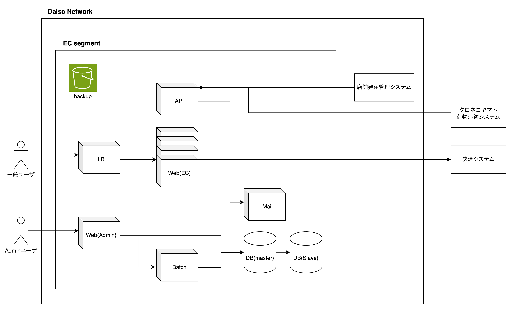

# 今年の初めに自分が考えていたこととその取り組み

2024/10/31 日高幸祐

## 2024年初めに自分が持っていた課題感

設計/コーディング周り(特にコーディング)で自分が自分に期待しているレベルのアウトプットが出せない

=> 新卒3年目よりも低いのではないかという漠然とした不安

### 日高の部署遍歴

- 2021/04 ~ 2022/05: ADMATRIX開発部 CREチーム
  - 仕事内容：保守運用業務(運用依頼、バグFix等)
- 2022/05 ~ 2023/12: B-Hack開発部 Frontendチーム
  - 仕事内容：新規機能開発、CI/CD整備、開発生産性向上への寄与
- 2024/01 ~ : SS開発部 第一グループ
  - 仕事内容：PTv2、(イメージ的に今後のマネジメント業務が多そう)

0->1でコーディングをやった経験が乏しいので、自信がない。思い描いていた3年目より劣っていて焦燥感がある

### 西山さんへ相談

- コードを書くこと(手段)に囚われすぎている
  - コードを書くことは手段であって目的ではない
- シニアに求められることは問題を解決すること => 目的
  - ドメインまで入り込んで、誰にどんなメリットがあるのかを考えて、リードできる人
  - ミドルにしても同じ
    - シニアから割り振られる大雑把なタスクを自分で考えて進められるかが大事
- つまり、取り組むべきはプロジェクトの要件定義から設計を自分で考えながら前に進めるトレーニング
  - 良い設計ができればコードは自ずと書ける

## ECサイト設計トレーニング

ダイソーが新しくECサイトを作るとして、その要件定義設計をする
デザインは今回の本質からズレるので、抜きにしていい

### 1. ECサイトのコンセプト

一重にECサイトといってもどんなコンセプトのECサイトにするのかによって必要な機能は変わってくる

ここでコンセプトをしっかり練っておくと、今後意見が割れた時にこのコンセプトに沿っているかどうかで判断をすることができる。

- コンセプトを考える上で加味したこと
  - ECが解決できる課題とは？
  - 実店舗とどのように共存していくのか？
  - コンセプト別ECサイトを使ってくれるターゲット層は？
  - ECを導入することによって発生する課題は？
    - 売り上げ/コスト計上
    - 物流
      - 送料
  - スモールスタートで始めるには？

上記を加味した上で、相手に確認をとりながら進めるのではなく、自分で全て主導権を握りながら考える。

わからないところは、聞くのではなく仮説を立ててそれをベースに話を進める。=> 相談をするのではなく合意形成をする

決定したコンセプト

- 顧客のUXを最大化するEC (アプリケーション)
  - 実店舗がすでにこれだけ展開されている中で、ECがそこまででしゃばる必要はない
  - 実店舗では賄いきれない部分をECで吸収してあげることで、ダイソー顧客のUXを最大化する

### 2. 機能設計

どんな機能がどんな優先順位で必要なのかを洗い出し、中身のプロセスまで設計を行う

- 機能設計において大事にしたい観点
  - 機能は顧客目線だけでなく、管理者目線でも考える
  - 実際に扱うデータ量を予測して設計をする。
    - データ量によってプロセスはかなり変化する
  - 機能の使い方を汲み取れる機能にする
  - 機能の説明では「簡潔にまとまっていること＋メリットがまとまっている」ことが大事
    - 自信を持って言い切る (「思ってます」、「想定してます」などは自信のなさが伺えて信頼度が落ちる)

実際に考えた機能例

- Admin機能
  - **商品登録機能**
    - 機能説明

        サービスのセットアップや追加商品の登録際、数十数百の商品を本システムに登録する必要があります。登録の方法には、画面経由で一つ一つ登録する形と、インプットファイルを用いてまとめて登録する形の2パターンが主かと思いますが、今回セットアップ時も商品追加時も一度に大量の商品を登録する必要があると考えたため、一件一件登録することは途方もない労力が必要です。そのためCSVフォーマットを用いてまとめて登録することのできる機能を提案します。また、CSVのフォーマットを決めてしまえば、既存のシステムとの連携も可能で、将来的には半自動 / 全自動にすることも視野に入れることができます。

    - 機能詳細
      - プロセス (データ量が膨大になりそうなので、batchで登録)
        1. クライアントが商品情報を商品登録機能のフォーマットに合った形のCSV形式で出力する
        2. システムにCSVファイルをアップロードする
        3. DBに商品が登録される
      - 必要なデータ
        - 商品名, 金額, 画像保存場所 (URL), 在庫数, …
      - 登録方法
        - CSV
        - (将来的に)既存の発注システムと連携して自動登録

### 3. アーキテクチャ設計

実装機能が固まったところで、その機能を動作することを想定したシステムアーキテクチャを考える

- アーキテクチャ設計時に大事にしたい視点
  - 最初スモールスタートで始める時に低予算で実現できるか
  - アプリケーションの規模が大きくなってきたときに、ボトルネックになりそうなところはどこか
    - スケールはしやすい設計になっているのか

実際に作ったアーキテクチャ

### 4. (脱線)DBのスペックの限界について

ボトルネックの話からDBの負荷についての話になった
詳細は省くので、興味ある人は[こちら](https://github.com/kosuke0430/DB_Performance_Compatison)のGitHub Repositoryから検証結果を確認してください

## まとめ

- ボールは常に自分で管理し、自分主体で物事を進める
- 使われ続けるシステムにするためにはどうすればいいのかを念頭におく
- クライアントへのMTGでは相談を行うのではなく合意形成を行う。
  - 自信を持ってクライアントに対して説明をする。
  - 自信がないように見えると、クライアントとしてもGOサインを出していいのか不安になる。