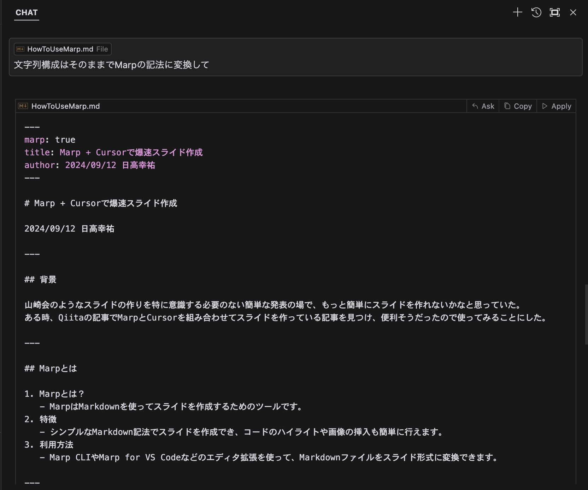
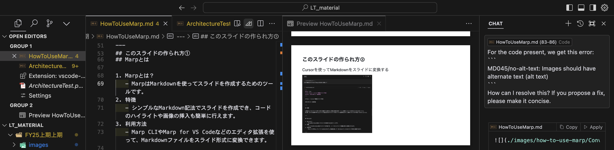
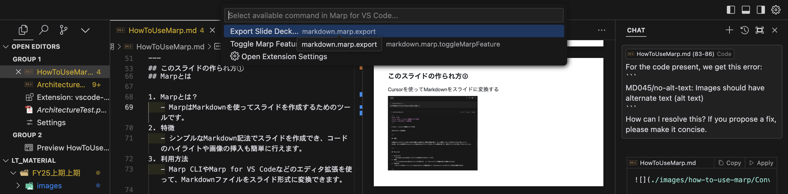

# Marp + Cursorで爆速スライド作成

2024/09/12 日高幸祐

---

### 背景

山崎会のようなスライドの作りを特に意識する必要のない簡単な発表の場で、もっと簡単にスライドを作れないかなと思っていた。
ある時、Qiitaの記事でMarpとCursorを組み合わせてスライドを作っている記事を見つけ、便利そうだったので使ってみることにした。

---

### Marpとは

1. Marpとは？
   - MarpはMarkdownを使ってスライドを作成するためのツールです。
2. 特徴
   - シンプルなMarkdown記法でスライドを作成でき、コードのハイライトや画像の挿入も簡単に行えます。
3. 利用方法
   - Marp CLIやMarp for VS Codeなどのエディタ拡張を使って、Markdownファイルをスライド形式に変換できます。

---

### Cursorとは?

- VSCodeをフォークして作られたエディタ
- AI機能が充実していて、コードの補完やコメントを自動で行ってくれる


---

### どのようにスライドを簡単に生成するのか？

1. 発表したい内容をMarkdownで書く
   1. MarpはMarkdownをスライドに変換するツールなので、まずは発表したい内容をMarkdownで書きます。
2. Cursorを使ってMarkdownをスライドに変換する
   1. Cursorを使ってMarkdownをスライドに変換するには、CursorのAI機能を使ってスライドを生成します。
3. 画像の挿入や細かい微修正をCursorのAIに頼りながら行う
4. Marpでpdfなどにexportしてスライドの完成

---

### このスライドの作られ方①

通常のMarkdownで発表内容を書き下す
```
# Marp + Cursorで爆速スライド作成

2024/09/12 日高幸祐

### 背景

山崎会のようなスライドの作りを特に意識する必要のない簡単な発表の場で、もっと簡単にスライドを作れないかなと思っていた。
ある時、Qiitaの記事でMarpとCursorを組み合わせてスライドを作っている記事を見つけ、便利そうだったので使ってみることにした。

### Marpとは

1. Marpとは？
   - MarpはMarkdownを使ってスライドを作成するためのツールです。
2. 特徴
   - シンプルなMarkdown記法でスライドを作成でき、コードのハイライトや画像の挿入も簡単に行えます。
3. 利用方法
   - Marp CLIやMarp for VS Codeなどのエディタ拡張を使って、Markdownファイルをスライド形式に変換できます。

   ...
```

---

### このスライドの作られ方②

Cursorを使ってMarkdownをスライドに変換する



---

### このスライドの作られ方③

細かい微修正を行ってPDFとしてexport





---

### Marpを使ってみて良いところ 

- Googleスライドなどではできないコードスニペットが使える
- スライドをGit管理できる
  - 発表内容に気を遣えばそのまま外部公開もできて一石二鳥
- Markdownで生成するのでQiitaの記事にも流用でき、逆に記事をMarpに変換してスライドにすることもできる
- 構成から細かいところまでAIガ直接編集しながら介入してくれるので、スライドの完成までがだいぶ早い

---

### Marpを使ってみてイマイチなところ

- スライドは細かく編集できるわけではないので、文字や図の表示位置を細かく修正しようとするのは結構労力がいる
  - 特に画像の扱い難しい...
  - CSSなどを用いてカスタムテーマが作成できるので、そこに投資ができれば使い勝手はかなり良くなりそう

---

### 参考文献

- [Marp: マークダウンでプレゼンテーションを作成する](https://qiita.com/piyonakajima/items/1084e2f2ba765e855271?utm_campaign=post_article&utm_medium=twitter&utm_source=twitter_share)