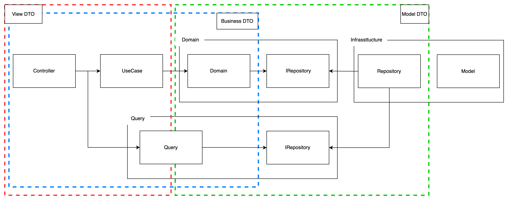
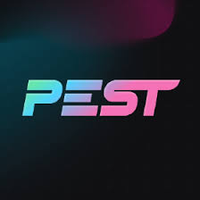

# アーキテクチャテスト

2024/09/12 日高幸祐

---

## 背景

現在afbのadminシステムのリプレイスを行なっている
- 単純なバージョンアップではなく、保守運用性と品質向上が目的
- レイヤードアーキテクチャを採用し、堅牢なシステムを目指す
- レビューの効率化のためアーキテクチャの自動テスト方法を模索

---

## 採用したアーキテクチャ

- クリーンアーキテクチャとCQRS設計パターンを混ぜた形



---

## 使用したテストツール

- **Pest**
  - PHPの最新のテストフレームワーク
  - Laravel 10からデフォルトのテストフレームワークとして採用
  - PHPUnitと完全に互換性があり、既存のPHPUnitテストも実行可能
  - テストの並列実行やグローバルアサーションなど、生産性を向上させる機能を搭載


---

## アーキテクチャテストの仕組み

- PHPの`use`文を利用したモジュールインポートを用いて依存関係をテスト

```php
<?php

namespace App\Services;

use App\Models\User;
use Illuminate\Support\Facades\Log;

class UserService
{
  public function createUser(string $name, string $email): User
  {
    $user = new User();
    $user->name = $name;
    $user->email = $email;
    $user->save();
    Log::info("新しいユーザーが作成されました: {$name}");
    return $user;
  }
}
```

---

## テスト内容

1. 依存関係テスト
2. クラスタイプテスト
   - Class, Enum, abstruct, interfaceなど
3. 命名規則テスト
   - 末尾文字の確認

---

## 実際のテストコード例

### 依存関係テスト
* 依存可能なレイヤーのディレクトリを指定し、そのディレクトリ内でのみ使用されているかを確認
```php
arch('Query can be used in App\Http\Controllers or App\Query', function (): void {
    $this->sut->not->toBeUsedIn($this->getUnAccessibleLayerBy(accessibleLayer: [
      $this->controllerDir(),
      $this->queryDir()
    ]))
    ->ignoring([$this->queryDir() . '\IRepository', $this->queryDir() . '\LoginUserQuery']);
});
```

---

### クラスタイプテスト
* 指定したディレクトリ配下のクラスがclassであるかを確認
  * `\IRepository`配下はテスト対象外
```php
arch('Query must be class', function(): void {
  $this->sut->toBeClasses()
    ->ignoring($this->queryDir() . '\IRepository');
});
```
---

### 命名規則テスト
* 指定したディレクト値配下のクラスの末尾が`Query`であるかを確認
  * `\IRepository`配下はテスト対象外
```php
arch('Suffix must be Query', function(): void {
  $this->sut->toHaveSuffix('Query')
    ->ignoring($this->queryDir() . '\IRepository');
});
```

---
# まとめ

- Pestを用いると単純なUnitテストだけでなく、アーキテクチャテストを行うことができる
- CIでテストを行うことができるので、レビュー担当者の負担が軽減する
  - 依存関係のルールの厳格化ができる
- Laravel10以上でアーキテクチャテストを検討している方がいらっしゃればご相談ください！

---
# 参考

- [Pest](https://pestphp.com/)
- [Pestを使ってアーキテクチャテストをやってみる](https://zenn.dev/naopusyu/articles/552173ec11f929)
- [気づいたら3日前にv3がリリースされてました](https://zenn.dev/casti/articles/2a754ba9b92ef7)
