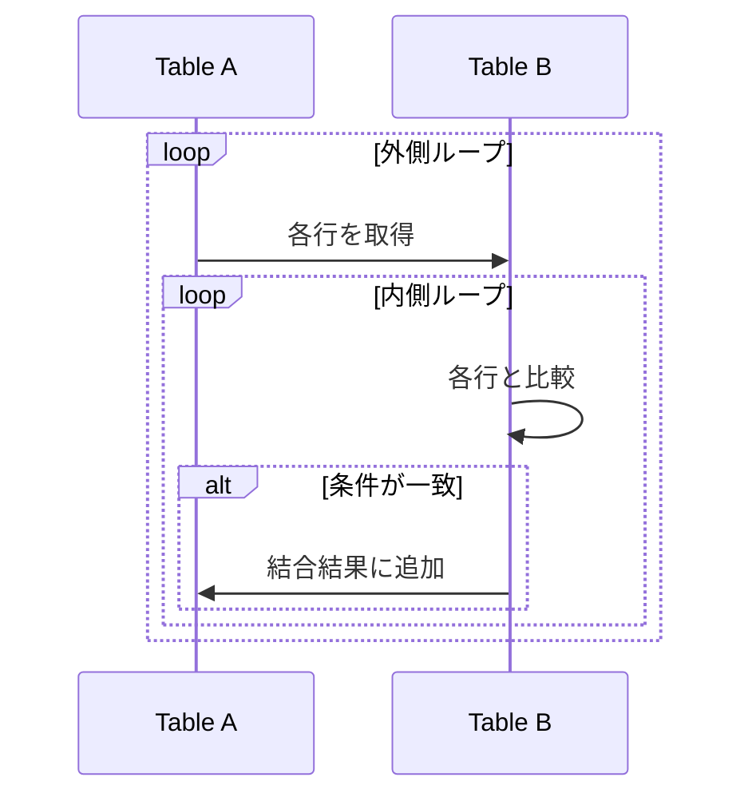
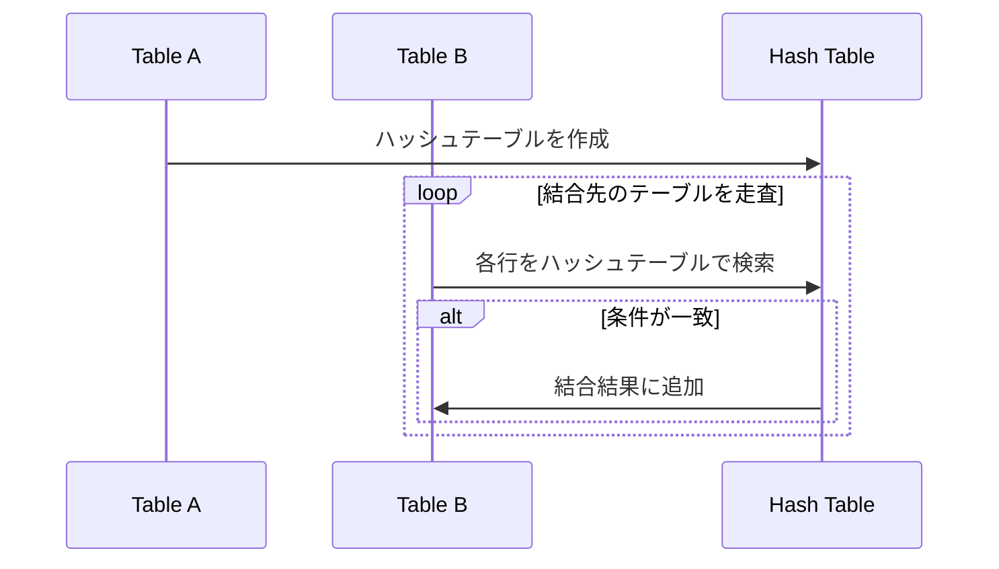
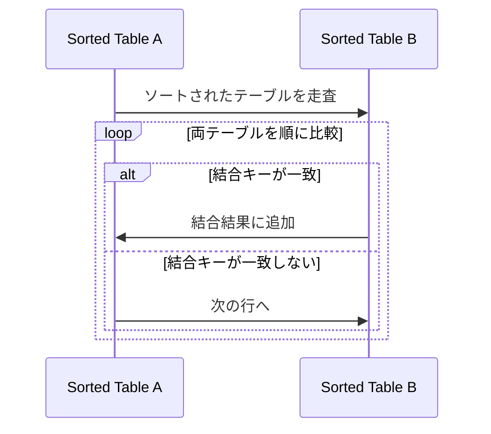

# MySQLでjoinを使うな

2024/10/16 日高幸祐

## 背景

admin-v2を開発していく中で古野さんから色々とアドバイスをもらう事が多いが、その中でMySQLはjoinが得意なDatabaseではないから極力joinを使わないようにしてほしいという話をもらった。

## MySQLがjoinに向かない理由

結論

SQLの結合アルゴリズムのNested Loopしか対応していないから

## 結合アルゴリズムの種類

- Nested Loop
- Hash Join
- Sort Merge Join

### Nested Loop

1. 結合元のテーブルのカラムを取得
2. 結合先のテーブルのカラムを1.で取得したカラムを用いて検索
3. 2.で取得したカラムを結合先のテーブルに結合

つまり計算量はO(N*M)

このアルゴリズムは、特に小さなテーブルやインデックスが適切に設定されている場合に有効ですが、大規模なデータセットではパフォーマンスが低下する可能性があります。
他の二つのアルゴリズムと比較してこのアルゴリズムのみどのような比較演算子も使用できます

### Hash Join

1. 結合元のテーブルのカラムを取得し、ハッシュテーブルを作成
2. 結合先のテーブルのカラムを取得し、ハッシュテーブルを用いて一致する行を検索
3. 一致した行を結合結果に追加

このアルゴリズムの計算量はO(N+M)で、特に大規模なデータセットに対して効率的です。

Hash Joinは、特に大規模なデータセットやインデックスがない場合に有効で、Nested Loopよりも効率的に動作します。ただ、ハッシュ値の比較のため、比較演算子は"="のみ対応しています。また、Hash JoinはHashテーブルを作成して比較を行うため、メモリを多く使用するため、メモリが不足しないように注意が必要です。

### Sort Merge Join

1. 結合元と結合先のテーブルをそれぞれ結合キーでソート
2. ソートされた両テーブルを順に走査し、結合キーが一致する行を結合
3. 一致した行を結合結果に追加

このアルゴリズムの計算量はO(N log N + M log M)で、ソートが必要ですが、結合キーがすでにソートされている場合に非常に効率的です。

Sort Merge Joinは、特に結合キーがすでにソートされている場合や、範囲条件を含む結合に対して有効です。Nested LoopやHash Joinに比べて、ソートが必要なため初期コストが高いですが、ソート済みデータに対しては非常に効率的に動作します。

### 各アルゴリズムのデータ量とコストの比較

- 基本的に"="結合の場合はhash joinが最も早く、容量の大きい場合はmerge join + sortが最も早い。
- 容量が多くなるにつれてnested loopの性能は悪くなっていくため、容量の少ないデータ同士の結合、'='演算子以外を用いて結合したい場合を除いて、あまり使いたくない

※「hash join」, 「merge join + sort」の段差はメモリに乗り切らなくなってディスク側にデータが漏れ出した時のもの。

## 主なDatabaseと対応している結合アルゴリズム比較

| Database | Nested Loop | Hash Join | Sort Merge Join |
| -------- | ------------ | ---------- | --------------- |
| MySQL    | ○            | ○ (8.0.18以降) | ×               |
| PostgreSQL | ○            | ○          | ○               |
| Oracle   | ○            | ○          | ○               |

## admin-v2でのMySQLで大規模テーブルのjoinを行う時の対処方法

前提条件
- Databaseはいじりたくない
  - 他の様々なプロダクトから参照されているため
  - 大規模なDatabaseのリプレイスプロジェクトが計画されているため

対応方法
- アプリケーション側に負荷をかける
  - 単テーブルずつレコードを抽出し、マージすることでjoinを実現する

## まとめ

- RDBのテーブル結合アルゴリズムには3種類存在する
  - Nested Loop
  - Hash Join
  - Sort Merge Join
- MySQLはNested Loopしか対応していないため、大量のデータを扱う場合はあまり向かないかもしれない