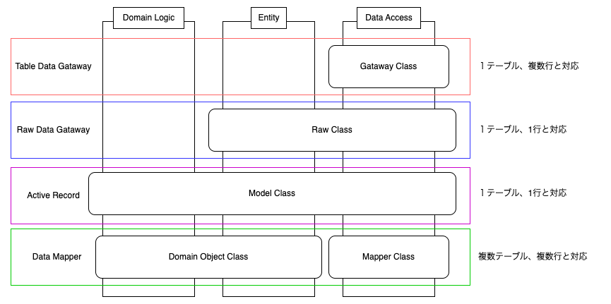

<style>
section {
  font-family: 'Helvetica Neue', Arial, sans-serif;
  padding: 20px 40px;
}
h1 {
  color: #0366d6;
  font-size: 2em;
}
h2 {
  color: #0366d6;
  border-bottom: 1px solid #ddd;
  padding-bottom: 0.3em;
}
h3 {
  color: #24292e;
}
code {
  font-family: 'SFMono-Regular', Consolas, 'Liberation Mono', Menlo, monospace;
  font-size: 0.85em;
  background-color: #f6f8fa;
  padding: 0.2em 0.4em;
  border-radius: 3px;
}
pre {
  background-color: #f6f8fa;
  border-radius: 3px;
  padding: 16px;
  font-size: 0.85em;
  overflow: auto;
}
table {
  border-collapse: collapse;
  width: 100%;
}
th, td {
  border: 1px solid #ddd;
  padding: 8px 12px;
}
th {
  background-color: #f6f8fa;
}
.columns {
  display: grid;
  grid-template-columns: 1fr 1fr;
  gap: 1em;
}
.small-code {
  font-size: 0.7em;
}
</style>

<!-- Mermaidのスクリプトを読み込む -->
<script src="https://cdn.jsdelivr.net/npm/mermaid/dist/mermaid.min.js"></script>

<!-- Mermaidの初期化 -->
<script>
  mermaid.initialize({ startOnLoad: true });
</script>

# LaravelのDBアクセスパターン

---

## 目次

1. 導入
2. PoEAAにおけるData Source Architectural Patterns
3. 各パターンの詳細解説
   - Table Data Gateway
   - Row Data Gateway
   - Active Record
   - Data Mapper
4. 各パターンの比較
5. Laravelで実装可能なDBアクセス方法
6. Laravelで実装可能なData Source Architectural Patterns
7. まとめ

---

## 1. 導入

Laravelでのデータベースアクセス方法には複数の選択肢があります：

<div class="small-code">

```php
// Eloquent ORMの例
$users = User::where('active', 1)->get();

// Query Builderの例
$users = DB::table('users')->where('active', 1)->get();

// Raw SQLの例
$users = DB::select('SELECT * FROM users WHERE active = ?', [1]);
```

</div>

- これらのアプローチには**長所と短所**があり、適切な状況で適切なパターンを選択することが重要
- 多くの開発者はこれらのパターンの使い分けを意識せずに開発を進めている

---

## 2. PoEAAにおけるData Source Architectural Patterns

### PoEAAとは

- **P**atterns of **E**nterprise **A**pplication **A**rchitecture
- Martin Fowlerが2002年に出版した書籍
- エンタープライズアプリケーション開発における様々なアーキテクチャパターンを紹介

### Data Source Architectural Patterns

アプリケーションとデータベース間のインタラクションを扱うパターン群：

1. **Table Data Gateway**: テーブル単位のゲートウェイ
2. **Row Data Gateway**: 行単位のゲートウェイ
3. **Active Record**: 行とビジネスロジックを統合
4. **Data Mapper**: DBとドメインオブジェクト間のマッピング層

---

## 3-1. Table Data Gateway

<div class="columns">
<div style="font-size: 0.85em;">

### 概念と特徴
- データベースの**1つのテーブル**に対する操作を1つのクラスにまとめる
- テーブルに対するゲートウェイとして機能
- ビジネスロジックは含まない

### メリット
- シンプルで理解しやすい
- SQLの最適化が容易
- テーブルごとに明確な責任分担

### デメリット
- ビジネスロジックとデータアクセスの分離が必要
- 複数テーブルを跨ぐ操作が複雑になる可能性

</div>
<div class="small-code" style="font-size: 0.65em;">

```php
class UserGateway {
    public function findAll() {
        return DB::select('SELECT * FROM users');
    }
    
    public function findById($id) {
        return DB::select(
            'SELECT * FROM users WHERE id = ?', 
            [$id]
        );
    }
    
    public function insert($data) {
        DB::insert(
            'INSERT INTO users (name, email) 
             VALUES (?, ?)', 
            [$data['name'], $data['email']]
        );
    }
}
```

</div>
</div>

---

## 3-2. Row Data Gateway

<div class="columns">
<div style="font-size: 0.85em;">

### 概念と特徴
- データベースの**1つの行**に対応するオブジェクト
- 各オブジェクトはデータベースの1行を表す
- 行に対する操作（取得、更新、削除）を提供
- Table Data Gatewayと異なり、各インスタンスは特定の行に対応

### メリット
- データベースの行とオブジェクトの対応が明確
- ビジネスロジックとデータアクセスの分離が可能

### デメリット
- 各行に対して別々のオブジェクトが必要
- リレーションシップの扱いが複雑になる可能性

</div>
<div class="small-code" style="font-size: 0.65em;">

```php
class UserRow {
    private $id;
    private $name;
    private $email;
    
    public function __construct($id = null) {
        if ($id) {
            $result = DB::select(
                'SELECT * FROM users WHERE id = ?', 
                [$id]
            );
            if (count($result) > 0) {
                $this->id = $result[0]->id;
                $this->name = $result[0]->name;
                $this->email = $result[0]->email;
            }
        }
    }
    
    // ゲッター・セッター
    
    public function save() {
        // 保存ロジック
    }
    
    public function delete() {
        // 削除ロジック
    }
}
```

</div>
</div>

---

## 3-3. Active Record

<div class="columns">
<div style="font-size: 0.85em;">

### 概念と特徴
- データベースの行と**ビジネスロジックを1つのクラス**に統合
- 各オブジェクトはデータベースの1行に対応
- データアクセスとビジネスロジックの両方を担当

### メリット
- シンプルで直感的なAPI
- データアクセスとビジネスロジックが統合
- 開発速度が速い

### デメリット
- 単一責任の原則に違反する可能性
- テストが難しくなる可能性
- 複雑なドメインモデルには適さない

</div>
<div class="small-code" style="font-size: 0.65em;">

```php
class User {
    private $id;
    private $name;
    private $email;
    
    // データアクセスメソッド
    public function save() {
        // 保存ロジック
    }
    
    public function delete() {
        // 削除ロジック
    }
    
    // ビジネスロジックメソッド
    public function isValidEmail() {
        return filter_var($this->email, 
                         FILTER_VALIDATE_EMAIL) !== false;
    }
    
    public function sendWelcomeEmail() {
        // メール送信ロジック
    }
    
    // 静的メソッド（ファインダーメソッド）
    public static function findAll() {
        // 全ユーザー取得ロジック
    }
}
```

</div>
</div>

---

## 3-4. Data Mapper

<div class="columns">
<div style="font-size: 0.85em;">

### 概念と特徴
- データベースとドメインオブジェクト間の**マッピングを担当する層**
- ドメインオブジェクトはデータベースの存在を意識しない
- Data Mapperがデータの変換と永続化を担当

### メリット
- ドメインオブジェクトとデータベースの完全な分離
- 複雑なドメインモデルに適している
- テストが容易

### デメリット
- 実装が複雑
- 開発速度が遅くなる可能性
- 小規模アプリではオーバーエンジニアリングに

</div>
<div class="small-code" style="font-size: 0.65em;">

```php
// ドメインオブジェクト
class User {
    private $id;
    private $name;
    private $email;
    
    // ゲッター・セッター
    
    // ビジネスロジック
    public function isValidEmail() {
        return filter_var($this->email, 
                         FILTER_VALIDATE_EMAIL) !== false;
    }
}

// Data Mapper
class UserMapper {
    public function find($id) {
        // DBからユーザーを取得しUserオブジェクトを返す
    }
    
    public function save(User $user) {
        // Userオブジェクトをデータベースに保存
    }
}
```

</div>
</div>

---

## 4. 各パターンの比較

<div style="font-size: 0.9em;">

| パターン | Domain Logic | Entity | Data Access | 複雑さ | 開発速度 | テスト容易性 |
|---------|--------------|--------|-------------|--------|----------|------------|
| **Table Data Gateway** | 別クラス | 別クラス | Gateway | 低 | 中 | 高 |
| **Row Data Gateway** | 別クラス | Gateway | Gateway | 中 | 中 | 高 |
| **Active Record** | Active Record | Active Record | Active Record | 中 | 高 | 中 |
| **Data Mapper** | Domain Object | Domain Object | Mapper | 高 | 低 | 高 |

</div>

- **Domain Logic**: アプリケーションの中で意味を持つ処理
- **Entity**: 意味あるデータのまとまりを管理するオブジェクト
- **Data Access**: Queryの発行など実際にDBとやり取りをするクラス

---

## 4. 各パターンの比較（図解）

<div style=" text-align: center;">
    
</div>

- Domain Logic: ドメインロジック。アプリケーションの中で意味を持つ処理
- Entity: 意味あるデータのまとまりを管理するオブジェクト
- Data Access: Queryの発行など実際にDBとやり取りをするクラス 

---

## 5. Laravelで実装可能なDBアクセス方法

| 方法 | 使いやすさ | 柔軟性 | 可読性 | パフォーマンス |
|-----|-----------|-------|-------|--------------|
| **Eloquent** | ◎ | ◯ | ◎ | △（複雑だと遅い） |
| **QueryBuilder** | ◯ | ◎ | ◯ | ◯ |
| **Raw SQL** | △ | ◎ | △ | ◎ |

<div class="columns">
<div>

### Eloquent（Active Record）
- Laravel標準のORM
- モデルクラスとテーブルが1対1
- リレーション・アクセサ・ミューテータ等

</div>
<div>

### Query Builder
- SQLに近い記法でクエリ構築
- モデルは使わず、テーブルベースで操作

### Raw SQL
- 生SQLをそのまま実行

</div>
</div>

---

## 6. Laravelで実装可能なData Source Architectural Patterns

<div class="columns">
<div>

### Active Record
- **Eloquent ORM**として既に実装
- Laravelの主要なデータアクセスパターン
- 小〜中規模のアプリケーションに最適

### Table Data Gateway
- **Query Builder**を使用して実装可能
- パフォーマンスが重視される場合に有用

</div>
<div>

### Row Data Gateway
- Eloquent ORMがActive Recordパターンを採用
- 純粋なRow Data Gatewayの実装は難しい
- カスタム実装は可能だが、Laravel哲学と不一致

### Data Mapper
- カスタム実装が必要
- Query Builderを使用して実装可能
- 複雑なドメインモデルに適している
- Doctrine ORMのようなライブラリを統合可能

</div>
</div>

---

## 7. まとめ：どんな時にどのパターンを使うべきか

<div class="columns">
<div>

### Eloquent ORM (Active Record)
- シンプルかつドメインオブジェクトとテーブルが1対1で紐付いている時
- **理由**：開発速度が速く、学習曲線が緩やか

### Raw SQL (基本的にQuery Builderを優先)
- パフォーマンスが極めて重視される場合

</div>
<div>

### Query Builder
- **Table Data Gateway**として
  - パフォーマンスが重視される場合
  - **理由**：SQLの最適化が容易、オーバーヘッドが少ない
- **Data Mapper (+ Repository)**として
  - 複雑なドメインロジックを持つ場合
  - **理由**：ドメインモデルとデータアクセスの分離、テスト容易性

</div>
</div>

---

## まとめ：パターン選択の指針

<div class="mermaid" style="width: 100%;">
graph LR
    Start[アプリケーション要件] --> Q1{ドメインモデルの複雑さ}
    Q1 -->|シンプル| Q2{開発速度重視?}
    Q1 -->|複雑| Q3{パフォーマンス重視?}
    
    Q2 -->|Yes| AR[Active Record/Eloquent]
    Q2 -->|No| Q4{パフォーマンス重視?}
    
    Q4 -->|Yes| TDG[Table Data Gateway/Query Builder]
    Q4 -->|No| AR
    
    Q3 -->|Yes| TDG
    Q3 -->|No| DM[Data Mapper/カスタム実装]
    
    AR --> End[実装]
    TDG --> End
    DM --> End
</div>
