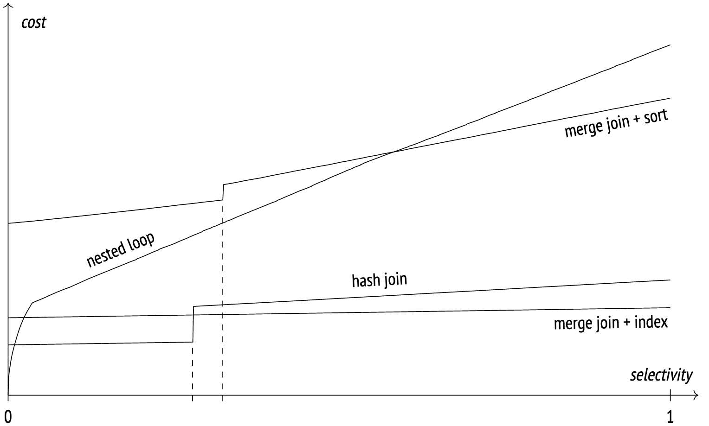

<!-- Load Mermaid script -->
<script src="https://cdn.jsdelivr.net/npm/mermaid/dist/mermaid.min.js"></script>

<!-- Initialize Mermaid -->
<script>
  mermaid.initialize({ startOnLoad: true });
</script>

# Avoid Using JOIN in MySQL

Kousuke Hidaka, 2024/10/16

---

## Background

While developing admin-v2, I received various advice from Mr. Furuno, one of which was, "MySQL is not a database that excels at JOIN operations, so try to avoid using JOIN as much as possible."

I had never heard this before, so I decided to investigate further.

---

## Why MySQL is not suitable for JOIN

Conclusion

Because it only supports the Nested Loop join algorithm.

---

## Types of Join Algorithms

- Nested Loop
- Hash Join
- Sort Merge Join

---

## Nested Loop

<div style="display: flex; justify-content: space-around;">
<div style="margin-top: 20px; font-size: 80%;">
<ol>
<li>Retrieve columns from the source table</li>
<li>Search the target table using the columns obtained in step 1</li>
<li>Join the columns obtained in step 2 to the target table</li>
</ol>

<p style="margin-top: 40px;">In other words, the computational complexity is O(N*M)</p>

</div>
<div class="mermaid" style="width: 60%;">
sequenceDiagram
    participant A as Table A
    participant B as Table B
    loop Outer Loop
        A->>B: Retrieve each row
        loop Inner Loop
            B->>B: Compare with each row
            alt Condition matches
                B->>A: Add to join result
            end
        end
    end
</div>
</div>
<div style="font-size: 60%;">
<p>
This algorithm is effective, especially for small tables or when indexes are properly set, but performance may degrade with large datasets.
</p>
<p>
Compared to the other two algorithms, this algorithm can use any comparison operator.
</p>
</div>

---

## Hash Join

<div style="display: flex; justify-content: space-around; font-size: 70%;">
<div>
<ol>
<li>Retrieve columns from the source table and create a hash table</li>
<li>Retrieve columns from the target table and search for matching rows using the hash table</li>
<li>Add matching rows to the join result</li>
</ol>

<p style="margin-top: 40px;">The computational complexity of this algorithm is O(N+M), making it efficient for large datasets.</p>

</div>
<div class="mermaid" style="width: 115%; margin-top: 30px">
sequenceDiagram
    participant A as Table A
    participant B as Table B
    participant H as Hash Table
    A->>H: Create hash table
    loop Scan target table
        B->>H: Search each row in hash table
        alt Condition matches
            H->>B: Add to join result
        end
    end
</div>
</div>
<div style="font-size: 60%;">
<p>
Hash Join is effective, especially for large datasets or when there are no indexes, and operates more efficiently than Nested Loop.
</p>
<p>
However, because it compares hash values, it only supports the "=" comparison operator. Also, since Hash Join creates a hash table for comparison, it uses a lot of memory, so care must be taken to avoid memory shortages.
</p>
</div>

---

## Sort Merge Join

<div style="display: flex; justify-content: space-around; font-size: 80%;">
<div>
<ol>
<li>Sort both the source and target tables by the join key</li>
<li>Sequentially scan the sorted tables and join rows with matching join keys</li>
<li>Add matching rows to the join result</li>
</ol>

<p style="margin-top: 40px;">
The computational complexity of this algorithm is O(N log N + M log M). Although sorting is required, it is very efficient when the join keys are already sorted.
</p>

</div>
<div class="mermaid" style="width: 110%;">
sequenceDiagram
    participant A as Sorted Table A
    participant B as Sorted Table B
    A->>B: Scan sorted tables
    loop Compare both tables sequentially
        alt Join keys match
            B->>A: Add to join result
            else Join keys do not match
            A->>B: Move to next row
        end
    end
</div>
</div>
<div style="font-size: 80%;">
<p>
Sort Merge Join is effective, especially when the join keys are already sorted or for joins involving range conditions. Although it has a high initial cost due to sorting, it operates very efficiently on sorted data compared to Nested Loop and Hash Join.
</p>
</div>

---

### Comparison of Data Volume and Cost for Each Algorithm

<div style="font-size: 80%;">
<ul>
<li>For "=" joins, hash join is generally the fastest, and for large volumes, merge join + sort is the fastest.</li>
<li>As the volume increases, the performance of nested loop deteriorates, so it is not preferred except for joining small datasets or when using operators other than '='.</li>
</ul>
</div>

<div style=" text-align: center;">
</img>
</div>
<div style="font-size: 60%;">
Note: The steps in "hash join" and "merge join + sort" occur when data spills over to the disk due to insufficient memory.
</div>

---

## Comparison of Supported Join Algorithms in Major Databases

| Database | Nested Loop | Hash Join | Sort Merge Join |
| -------- | :------------: | :----------: |:---------------: |
| MySQL    | ○            | ○ (from 8.0.18) | ×               |
| PostgreSQL | ○            | ○          | ○               |
| Oracle   | ○            | ○          | ○               |

---

<style scoped>
section {
  font-size: 20px;
}

section h2 {
  font-size: 32px;
}
</style>

## How to Handle Large Table Joins in MySQL for admin-v2

Prerequisites
- Do not want to modify the database
  - Because it is referenced by various other products
  - A large-scale database replacement project is planned

Approach
- Put the load on the application side
  - Extract records from each table individually and merge them to achieve the join

Supplement
- In cloud-based systems, considering the ease of scaling in/out, it is easier to put the load on the app rather than the DB, making it easier from an infrastructure perspective.

---

## Summary

- There are three types of RDB table join algorithms
  - Nested Loop
  - Hash Join
  - Sort Merge Join
- MySQL only supports Nested Loop, so it may not be suitable for handling large amounts of data
  - However, since version 8.0.18, Hash join is available, so MySQL is not necessarily less user-friendly in terms of join algorithms
    ```
    SET optimizer_switch = 'hash_join=on';
    ```

---

## References
* [Differences and Performance Comparison of Nested Loop/Hash/Sort Merge Joins](https://zenn.dev/loglass/articles/84f15be9a4d2c9)
* [Queries in PostgreSQL: 7. Sort and merge](https://postgrespro.com/blog/pgsql/5969770)
* [[SQL] About the Three Types of Join Algorithms](https://zenn.dev/captain_blue/articles/three-types-of-join-algorithms)
