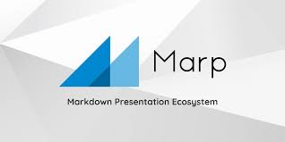
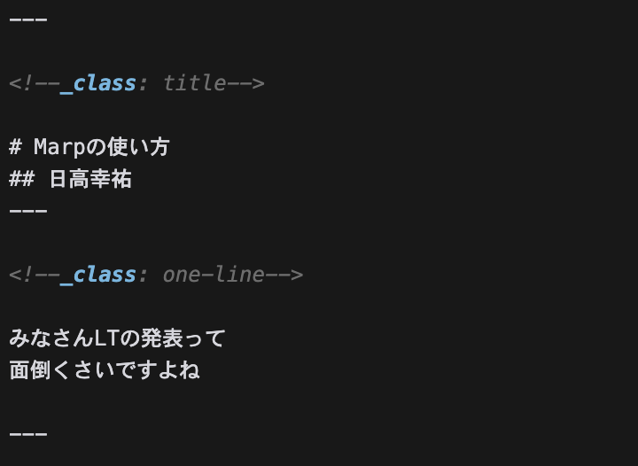
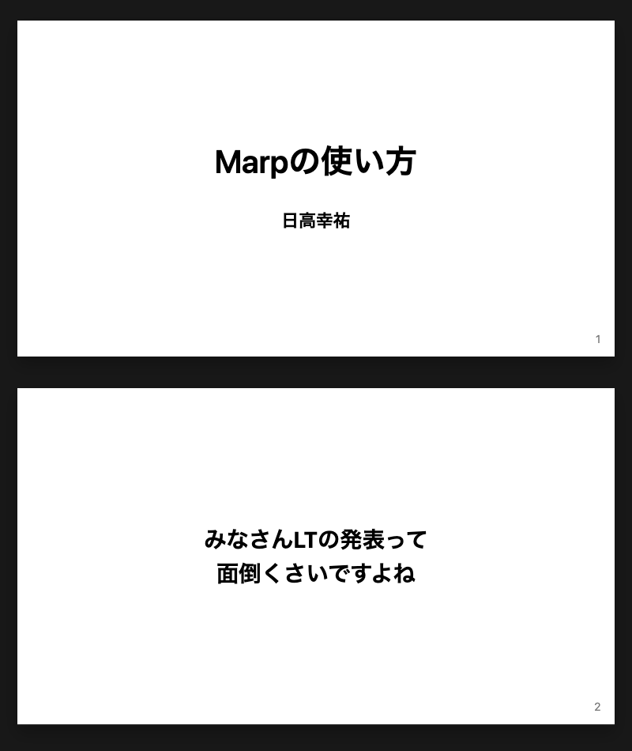

<!--_class: title-->

# Marpの使い方
## 日高幸祐
---

<!--_class: one-line-->

みなさんLTの発表って
面倒くさいですよね

---

<!--_class: one-line-->
 発表内容は決まっていても、
 どう発表するのか、流れは？オチは？
 そんなことを考えてスライドを作るのって
 めっちゃ面倒くさいと思います。

---

<!--_class: one-line-->>

みなさん思いませんか？
発表したい内容さえ決めればほぼ自動で発表の流れやスライドが生成されれば、
LTなんで週一回くらいできるよと

---

<!--_class: one-line-->>

そんな時Markdownでスライドを作ることができる
Marpというツールを見つけました。

---

<!--_class: title-->
# Marpの概要

---
# Marpとは？

MarpはMarkdownを使ってスライドを作成するためのツールです。

---

<!--_class: one-line-->>

こんなMarkdownが

---

<!--_class: one-line-->>

こんなスライドに

---

# 使い方

1. Markdownファイルを作成
2. Marpで開く
3. スライドを編集・保存

---

# 参考文献
* [Marp: マークダウンでプレゼンテーションを作成する](https://qiita.com/piyonakajima/items/1084e2f2ba765e855271?utm_campaign=post_article&utm_medium=twitter&utm_source=twitter_share)